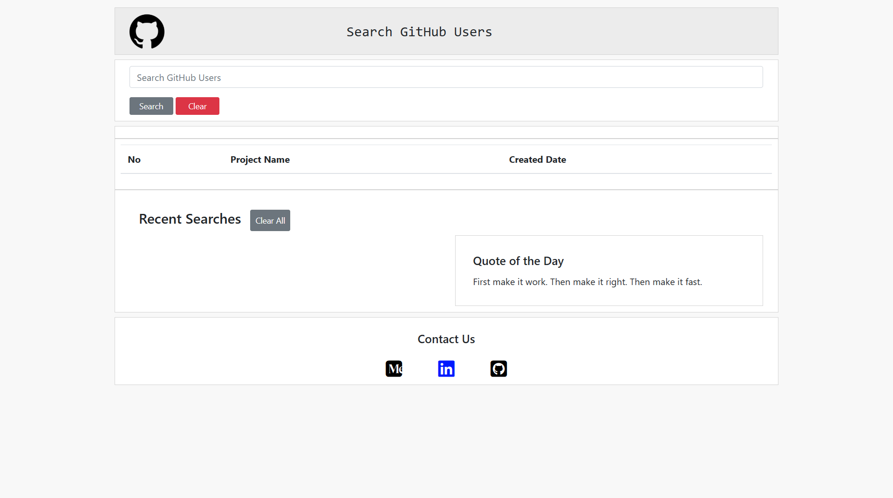
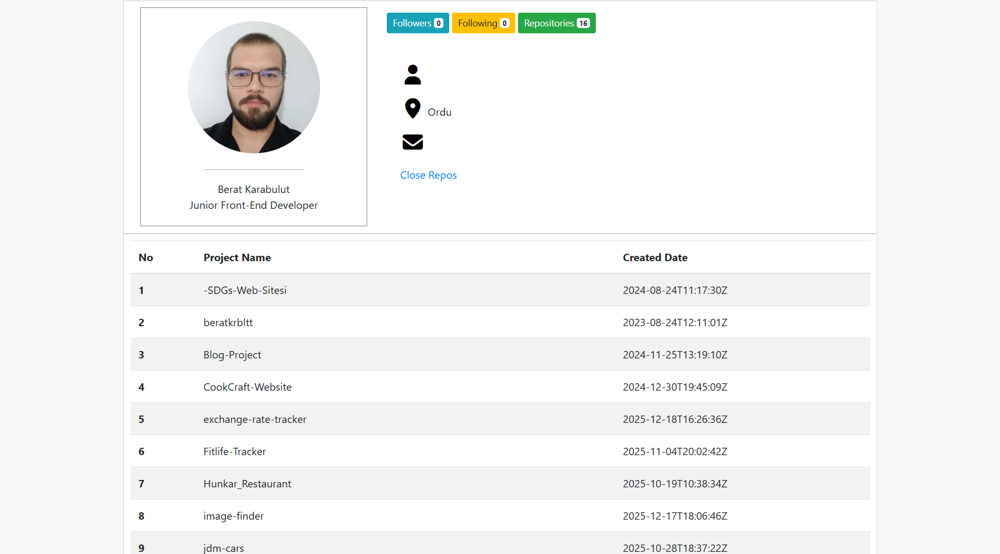

# GitHub Profile Explorer

A modular GitHub profile explorer application built with Vanilla JavaScript, focusing on clean architecture and API integration.

GitHub Profile Explorer is a modern and responsive web application that allows users to search for GitHub profiles and view detailed user information using the **GitHub REST API**.

The project is developed with **HTML, CSS, and Vanilla JavaScript**, following a modular file structure to improve code readability, maintainability, and scalability.

---

## 🚀 Features

* 🔍 Search GitHub users by username
* 👤 View detailed profile information
  * Avatar
  * Bio
  * Followers & Following
  * Public repositories
* 📦 Fetch real-time data from GitHub API
* 📱 Fully responsive (mobile & desktop)
* ⚡ Uses Fetch API with async/await
* 🧩 Modular JavaScript architecture
* 🧼 Clean and readable code structure

---

## 🎥 Preview

  

---

## 🗂️ Project Structure

The project is structured in a modular way to keep responsibilities separated and the codebase easy to maintain.

